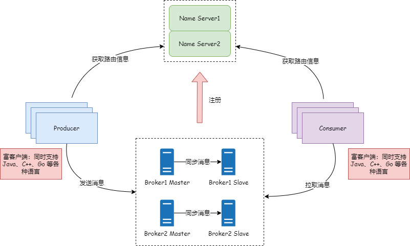

# RocketMQ 4.x

## 端口号列表

| 端口号   | 所属服务器        | 用途                                        |
|-------|--------------|-------------------------------------------|
| 9876  | NameServer   | 命名服务对外端口                                  |
| 10911 | BrokerServer | Broker 接收生产者的消息，处理消费者拉取消息。（上报给NameServer） |
| 10909 | BrokerServer | Broker 接收生产者的消息，不能处理消费者拉取消息。              |
| 10912 | BrokerServer | Broker用于主从同步                              |
| 9800  | DashBoard    | 管理后台                                      |

## 架构图



## Docker部署开发环境

至少启动一个NameServer，一个Broker。

### NameServer

```shell
# NameServer
docker run -d \
      --name rocketmq-namesrv \
      -p 9876:9876 \
      -e "JAVA_OPT_EXT=-Xms512M -Xmx512M -Xmn128m" \
      apache/rocketmq:latest \
      sh mqnamesrv
```

### Broker

```shell
# Broker
docker run -d \
      --name rmqbroker \
      -p 10911:10911 \
      -p 10909:10909 \
      -p 10912:10912 \
      --link rocketmq-namesrv \
      -e "JAVA_OPT_EXT=-Xms512M -Xmx512M -Xmn128m" \
      -e "NAMESRV_ADDR=rocketmq-namesrv:9876" \
      apache/rocketmq:latest \
      sh mqbroker -c /home/rocketmq/rocketmq-4.9.2/conf/broker.conf
```

**需要注意的是**，NameServer下发的是Docker容器的内网IP地址，从宿主机的外网访问是访问不了的，需要进行配置：

```bash
vi /home/rocketmq/rocketmq-5.1.4/conf/broker.conf
```

添加如下配置，brokerIP1可以是ip也可以是dns，hostname：

```ini
brokerIP1 = host.docker.internal
```

### Web控制台

```shell
docker pull styletang/rocketmq-console-ng:latest

docker run -d \
    --name rmqconsole \
    -p 9800:8080 \
    --link rocketmq-namesrv \
    -e "JAVA_OPTS=-Drocketmq.namesrv.addr=rocketmq-namesrv:9876 -Dcom.rocketmq.sendMessageWithVIPChannel=false" \
    -t styletang/rocketmq-console-ng:latest
```

控制台访问地址： <http://localhost:9800/#/>

## 参考资料

* [什么是消息队列RocketMQ版？](https://help.aliyun.com/document_detail/29532.html?userCode=qtldtin2)
* [RocketMQ 介绍及核心概念](https://www.jianshu.com/p/2ae8e81718d3)
* [RocketMQ 简介](https://segmentfault.com/a/1190000038844218)
