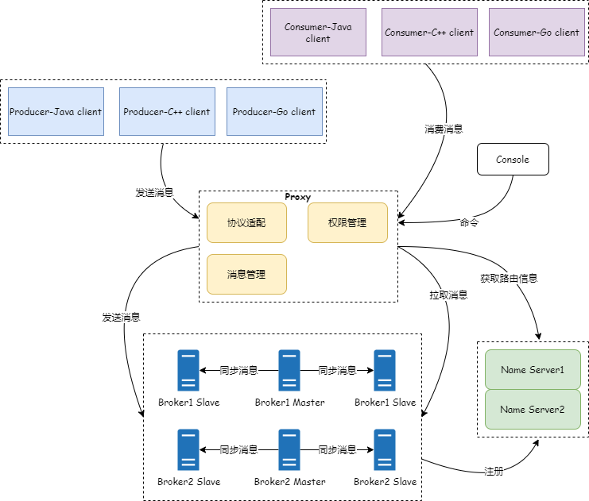

# RocketMQ 5.x

| 端口号   | 所属服务器        | 用途                                        |
|-------|--------------|-------------------------------------------|
| 9876  | NameServer   | 命名服务对外端口                                  |
| 10911 | BrokerServer | Broker 接收生产者的消息，处理消费者拉取消息。（上报给NameServer） |
| 10909 | BrokerServer | Broker 接收生产者的消息，不能处理消费者拉取消息。              |
| 10912 | BrokerServer | Broker用于主从同步                              |
| 8080  | Proxy        | Remoting 协议                               |
| 8081  | Proxy        | gRPC 协议                                   |

## 架构图



## Docker部署开发环境

至少启动一个NameServer，一个Broker。

5.x版本下，官方建议使用Local模式部署，即Broker和Proxy同进程部署。

创建网桥

```shell
docker network create rmq-network
```

### NameServer

```bash
# NameServer
docker run -d \
    --name rocketmq-namesrv \
    --network rmq-network \
    -e "MAX_HEAP_SIZE=256M" \
    -e "HEAP_NEWSIZE=128M" \
    -e "JAVA_OPT_EXT=-server -Xms512M -Xmx512M -Xmn128m" \
    -p 9876:9876 \
    apache/rocketmq:5.1.4 \
    sh mqnamesrv
```

### Broker

```bash
# Broker
docker run -d \
    --name rocketmq-broker \
    --link rocketmq-namesrv \
    --network rmq-network \
    -p 10911:10911 \
    -p 10909:10909 \
    -p 8080:8080 \
    -p 8081:8081 \
    -e "MAX_HEAP_SIZE=256M" \
    -e "HEAP_NEWSIZE=128M" \
    -e "JAVA_OPTS=-server -Xmx256M -Xms256M -Xmn128M" \
    -e "NAMESRV_ADDR=rocketmq-namesrv:9876" \
    apache/rocketmq:5.1.4 \
    sh mqbroker --enable-proxy autoCreateTopicEnable=true autoCreateSubscriptionGroup=true \
    -c /home/rocketmq/rocketmq-5.1.4/conf/broker.conf
```

### Web控制台

```bash
docker run -d \
    --restart=always \
    --name rocketmq-dashboard \
    --link rocketmq-namesrv \
    --network rmq-network \
    -e "JAVA_OPTS=-Xmx256M -Xms256M -Xmn128M -Drocketmq.namesrv.addr=rocketmq-namesrv:9876 -Dcom.rocketmq.sendMessageWithVIPChannel=false" \
    -p 9800:8080 \
    apacherocketmq/rocketmq-dashboard
```

- 控制台访问地址： <http://localhost:9800/#/>

## 参考资料

* [什么是消息队列RocketMQ版？](https://help.aliyun.com/document_detail/29532.html?userCode=qtldtin2)
* [RocketMQ 介绍及核心概念](https://www.jianshu.com/p/2ae8e81718d3)
* [RocketMQ 简介](https://segmentfault.com/a/1190000038844218)
* [RocketMQ 5.0：无状态代理模式的探索与实践](https://www.cnblogs.com/alisystemsoftware/p/16776559.html)
